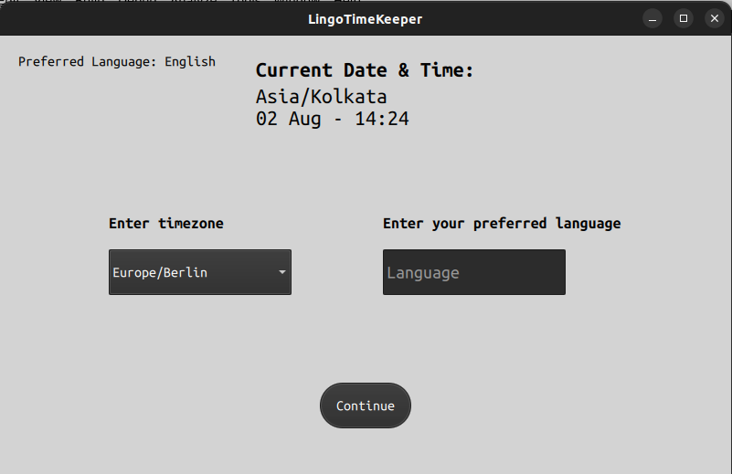
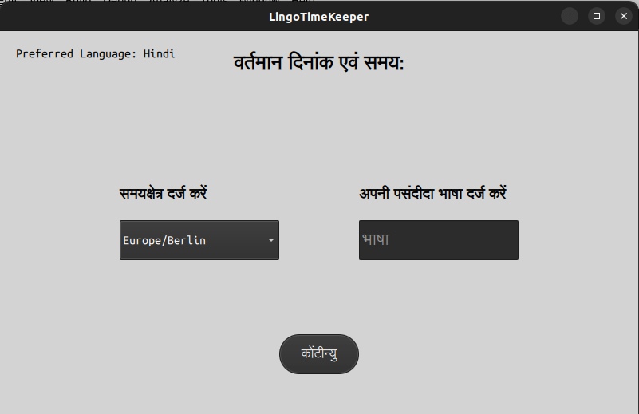

# LingoTimeKeeper

## Overview
LingoTimeKeeper is a versatile Qt Quick application developed using C++ and QML. The application allows users to select their preferred language and timezone, storing these preferences using the QSettings library. On application restart, it retrieves and applies the saved settings, displaying the interface in the selected language and showing the current date and time according to the chosen timezone.

## Features
- **Language Selection**: Switch between Hindi and English seamlessly.
- **Timezone Selection**: Display the current date and time based on the selected timezone.
- **Persistent Settings**: Save and restore user preferences across sessions.
- **Dynamic Language Update**: Utilize Qt Linguist tools to dynamically update the interface language.

## UI Components
- **Language and Timezone Selector**
    *ComboBox for Language Selection:*
        - Choose between English and Hindi.
    *ComboBox for Timezone Selection:*
        - Select from various timezones.
- **Display Area**
    *Current Time Display:*
        - Shows the time according to the selected timezone.
    *Current Date Display:*
        - Shows the date according to the selected timezone.

## Screenshot

- *LingoTimeKeeper 1*



- *LingoTimeKeeper 2*



## Installation
### Prerequisites
- Qt 5.12 or higher
- C++ compiler
- Git

### Steps
1. **Clone the repository:**
   ```bash
   git clone https://github.com/yourusername/lingotimekeeper.git

2. **Clone the repository:**
   ```bash
   cd lingotimekeeper

3. Build the project:
    Using Qt Creator: Open the cmakelist.txt file in Qt Creator and build the project.
    Using the command line:
    ```bash
    qmake
    make

    
##Contribution
*If you wish to contribute to the project, please fork the repository, make your changes, and create a pull request. Contributions are welcome!*
